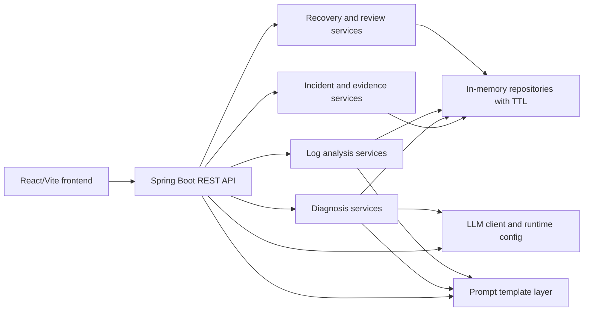
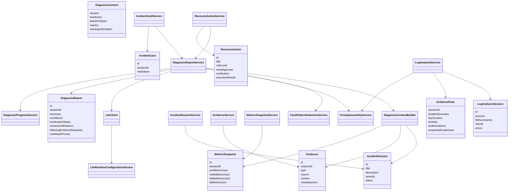
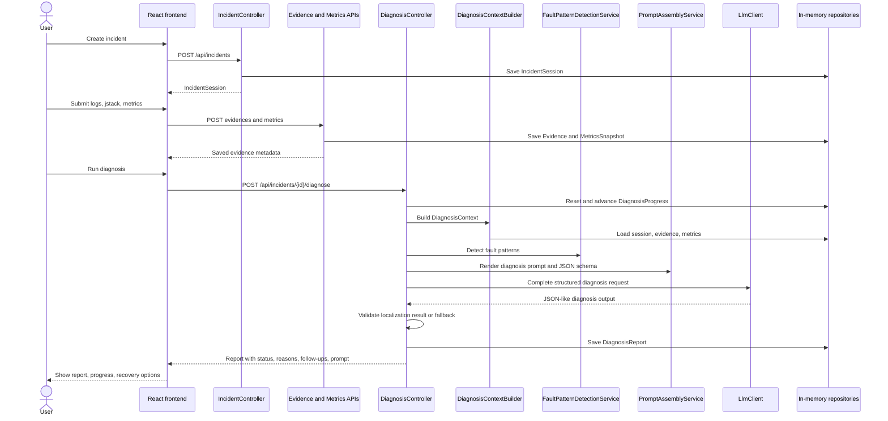
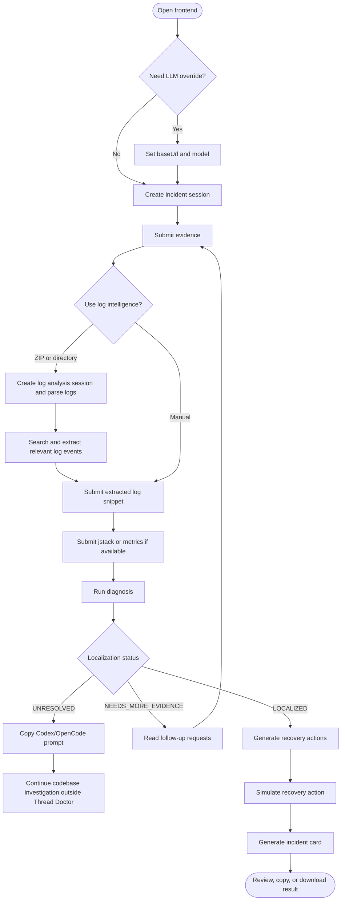
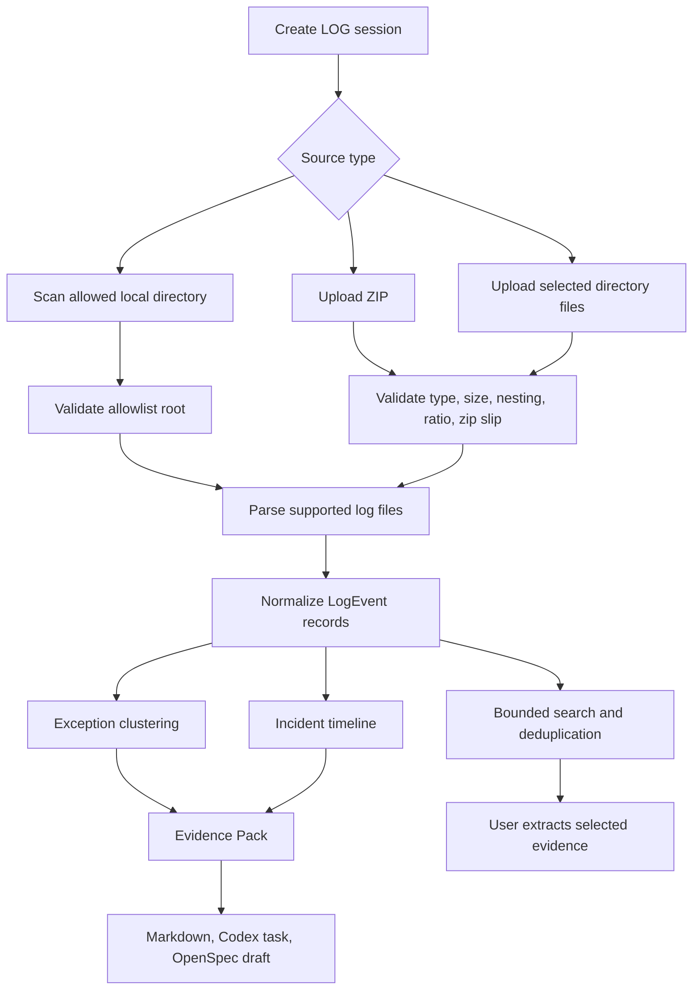
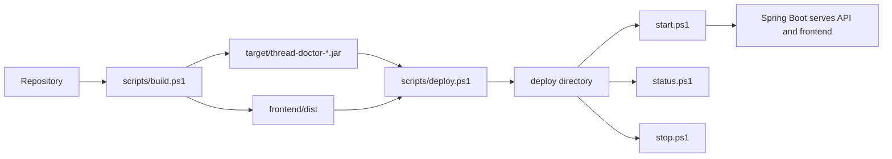

# Thread Doctor 设计说明

Thread Doctor 是一个面向 Java 生产故障诊断的轻量化工具。它通过前端引导用户创建故障会话、提交日志和运行时证据，后端在内存缓存中组织诊断上下文，结合规则检测、LLM 结构化诊断、日志智能分析、恢复建议和复盘文档输出，帮助用户快速定位问题或生成适合 Codex/OpenCode 继续基于代码库排查的提示词。

## 总体架构



### 运行组成

- 前端服务: `frontend/src/App.jsx` 提供会话式诊断界面，`workflow.js` 管理状态流，`diagnosisApi.js` 封装后端 API。
- 后端服务: Spring Boot 单体应用，控制器位于 `com.geek.threaddoctor.api`，业务按 incident、evidence、diagnosis、loganalysis、prompt、llm、recovery、memory、security 等包拆分。
- 存储模型: 当前实现不依赖数据库，所有会话、证据、报告、日志分析结果、恢复动作、复盘卡片都通过内存仓库和统一缓存策略保存。
- 部署形态: `scripts/build.ps1` 打包后端 jar 和前端静态资源，`scripts/deploy.ps1` 生成 `deploy` 运行目录，`start.ps1/status.ps1/stop.ps1` 管理运行进程。

## 核心能力

### 1. 会话式故障诊断

用户从前端创建 incident session，逐步提交日志、jstack、JVM/Redis/Kafka/DB 指标等证据。后端将这些数据组合为 `DiagnosisContext`，先运行确定性故障模式检测，再调用 LLM 生成结构化诊断报告。

核心对象:

- `IncidentSession`: 故障会话，记录标题、描述、严重级别和状态。
- `Evidence`: 用户提交的证据，支持日志片段、jstack、指标和人工备注等类型。
- `MetricsSnapshot`: JVM、Redis、Kafka、DB 指标快照。
- `DiagnosisReport`: 诊断结果，包含摘要、置信度、定位状态、未定位原因、补充证据请求和可选 codebase prompt。
- `DiagnosisProgress`: 诊断进度缓存，用于前端轮询展示。

### 2. 规则检测和 LLM 诊断

`FaultPatternDetectionService` 聚合多个规则检测器，当前覆盖 Redis 连接池耗尽、锁竞争、Full GC 压力、Kafka lag 等典型问题。规则结果和证据上下文会进入 prompt 模板层，交给 `LlmClient` 生成 JSON 诊断输出。

LLM 输出不会被直接当作最终事实使用。后端会校验摘要、置信度、`localizationStatus` 等字段:

- `LOCALIZED`: 证据足以定位明确问题。
- `UNRESOLVED`: 证据不足或无法连接到明确根因。
- `NEEDS_MORE_EVIDENCE`: 需要用户继续补充日志、jstack、指标、traceId 或时间窗口。

当模型输出不完整或无法解析时，系统会生成未定位报告，而不是返回不可靠的最终结论。

### 3. 未定位诊断交接

当诊断无法明确定位时，报告会返回:

- 未定位原因。
- 结构化补充证据请求。
- 可复制的 Codex/OpenCode codebase investigation prompt。

该 prompt 是文档型交接产物（document-only handoff artifact），仅用于复制到具备代码库能力的工具中继续定位。Thread Doctor 本身不会执行 prompt，不会扫描代码库，也不会自动修改文件。

### 4. 日志智能和 Evidence Pack

`LogAnalysisService` 支持创建日志分析会话、上传 ZIP、上传浏览器选择的目录文件、扫描配置允许的本地目录，并解析 Java 日志事件。解析结果可用于:

- 日志搜索: 支持关键词、级别、时间范围、traceId、线程、logger、异常类型、文件、去重和是否返回堆栈。
- 异常聚类: 基于异常类型、标准化消息和顶部堆栈帧生成 fingerprint。
- 时间线: 提取 WARN/ERROR、异常、高风险关键词和 trace 相关事件。
- Evidence Pack: 输出 JSON 或 Markdown，包含关键聚类、时间线、证据项、疑似代码区域、建议检查和限制说明。
- Codex/OpenSpec 文档: 从 Evidence Pack 生成 Codex 调查任务或 OpenSpec 草案，均为文档响应，不自动执行。

### 5. 恢复建议和复盘文档

诊断报告生成后，用户可以请求恢复建议。`RecoveryActionService` 基于报告生成风险等级、审批要求和验证方式。恢复动作执行当前为模拟模式，返回 `SIMULATED` 结果，不直接操作生产环境。

`IncidentCardService` 可以生成 Markdown 复盘文档，汇总故障、诊断结论、证据、恢复动作和后续建议，前端支持复制和下载。

### 6. Prompt 模板管理

`PromptAssemblyService` 通过 typed prompt template 加载并渲染:

- 诊断 system prompt、user prompt、JSON schema。
- Evidence Pack 到 Codex 调查任务。
- Evidence Pack 到 OpenSpec 草案。
- 诊断报告到 codebase investigation prompt。
- 复盘文档模板。

严格渲染开启时，缺失变量会在调用 LLM 前失败，避免模型收到不完整 prompt。

### 7. LLM 运行时配置

前端提供 LLM configuration 面板，可以热更新:

- `baseUrl`
- `model`

API key 不允许通过前端或 YAML 明文配置。后端只从运行环境变量 `LLM_API_KEY` 获取 API key，并且配置状态接口只返回脱敏状态。前端配置缺省时，后端使用服务端默认配置。

### 8. 安全边界

系统对前端输入和高成本操作设置了明确边界:

- REST path/body 使用 Bean Validation 校验长度、格式、枚举和必填字段。
- 日志 ZIP 解析限制文件数、大小、压缩比、嵌套深度和 Zip Slip。
- 本地目录扫描必须在允许根目录下。
- 日志搜索限制关键词长度、片段数、级别、时间范围和返回数量。
- 证据、指标、生成文档和 prompt 输出都做长度限制。
- 敏感数据通过 masking/sanitizer 处理，避免返回 token、password、api-key、authorization 等明文。
- 所有缓存数据均为应用内存数据，不引入数据库或外部持久化。

## 模块类图



## 主诊断时序图



## 用户活动图



## 日志智能流程图



## 部署和运行



常用命令:

```powershell
powershell -ExecutionPolicy Bypass -File .\scripts\build.ps1
powershell -ExecutionPolicy Bypass -File .\scripts\deploy.ps1 -SkipBuild
powershell -ExecutionPolicy Bypass -File .\deploy\start.ps1
powershell -ExecutionPolicy Bypass -File .\deploy\status.ps1
powershell -ExecutionPolicy Bypass -File .\deploy\stop.ps1
```

默认访问地址为 `http://localhost:8080/`。生产运行时应在环境变量中设置 `LLM_API_KEY`，并根据需要配置后端 `baseUrl`、`model`、日志分析限制和缓存 TTL。

## 主要 API 边界

| Area | Endpoint prefix | Purpose |
| --- | --- | --- |
| Incident | `/api/incidents` | 创建故障会话、读取会话详情、提交证据 |
| Metrics | `/api/incidents/{sessionId}/metrics` | 提交 JVM/Redis/Kafka/DB 指标快照 |
| Diagnosis | `/api/incidents/{sessionId}/diagnose` | 生成诊断报告 |
| Progress | `/api/incidents/{sessionId}/diagnosis-progress` | 查询诊断进度 |
| Recovery | `/api/incidents/{sessionId}/recovery-actions` | 生成和模拟恢复动作 |
| Incident card | `/api/incidents/{sessionId}/incident-card` | 生成和读取复盘文档 |
| Log analysis | `/api/log-analysis/sessions` | 日志解析、搜索、聚类、时间线、Evidence Pack、文档生成 |
| LLM config | `/api/llm/configuration` | 查看、保存、清空运行时 LLM baseUrl/model 配置 |

## 设计约束

- 轻量部署优先: 后端 jar 和前端静态资源可由脚本快速打包、部署和拉起。
- 缓存优先: 当前业务数据存储在应用内存中，适合诊断会话和临时分析场景。
- 证据优先: 规则检测、LLM 诊断和生成文档都基于用户提交或日志解析得到的证据。
- 安全优先: 所有高风险输入都有边界，所有敏感输出需要脱敏或限制长度。
- 文档交接优先: Codex/OpenCode/OpenSpec 相关产物只作为 Markdown document-only 文档返回，不自动执行工具或修改仓库。
